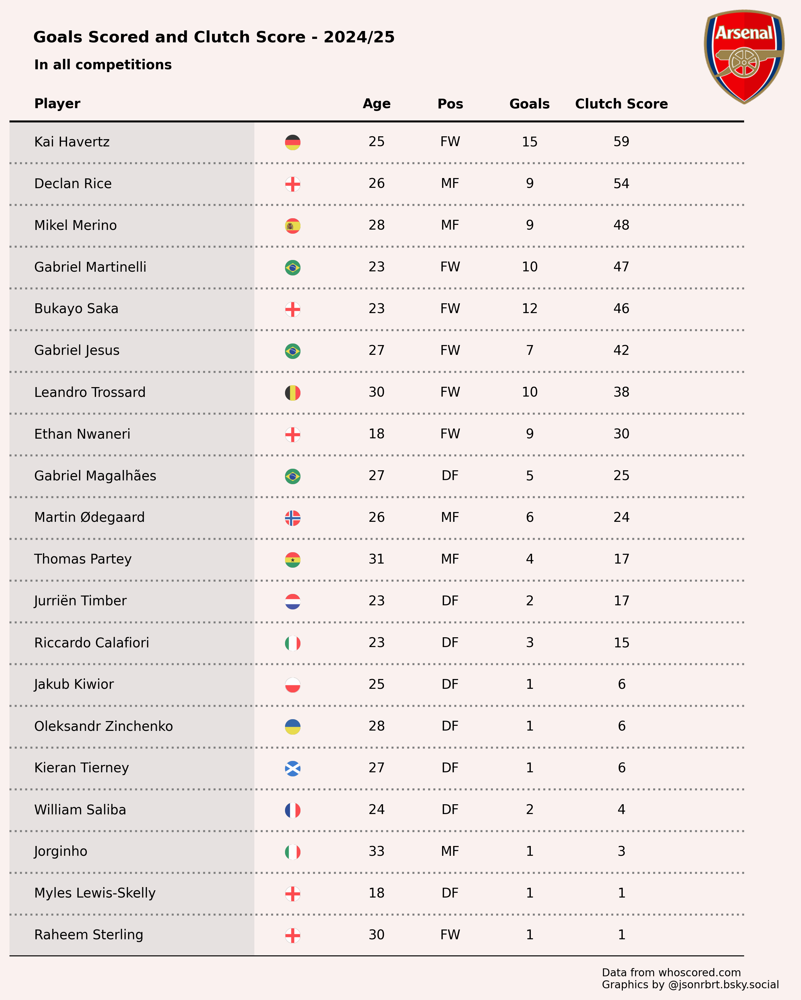
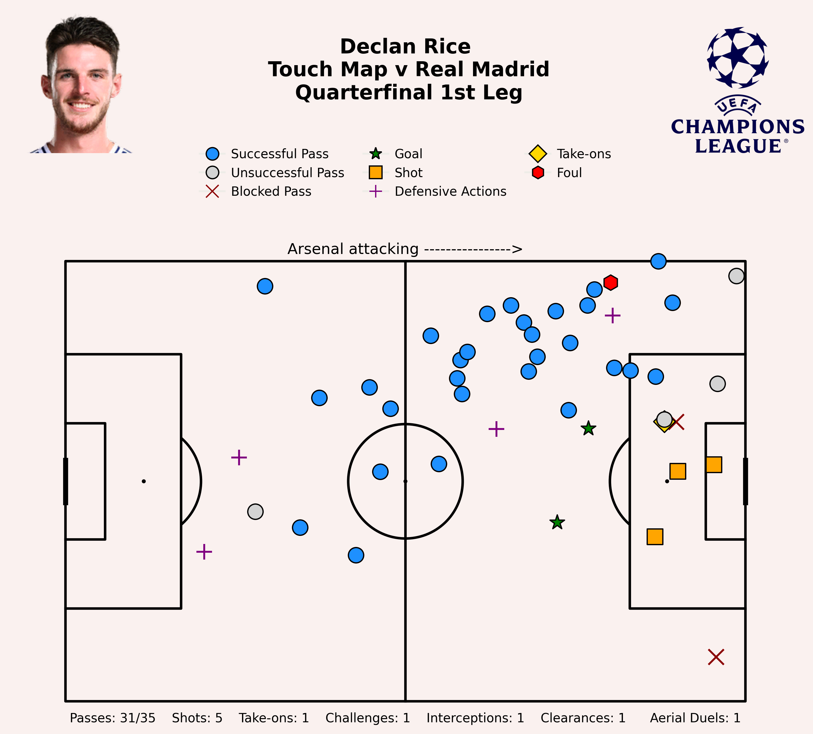
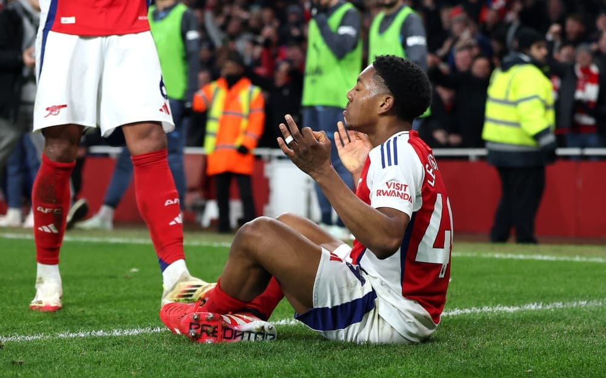
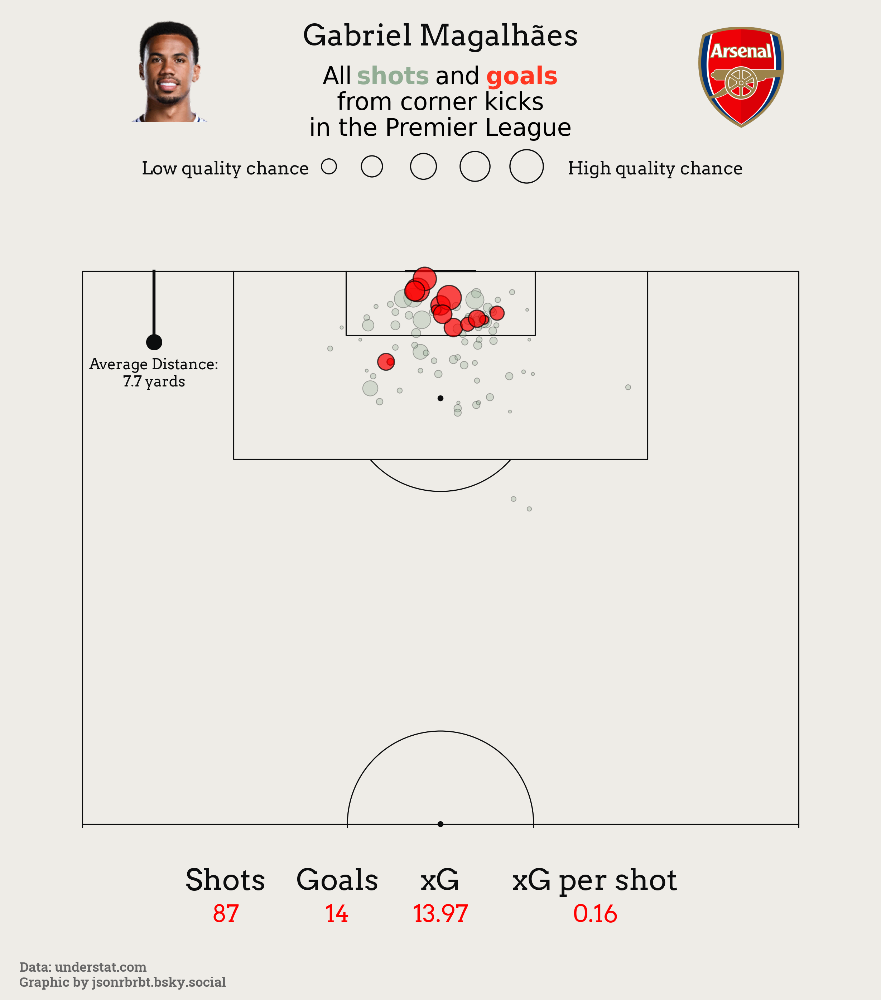
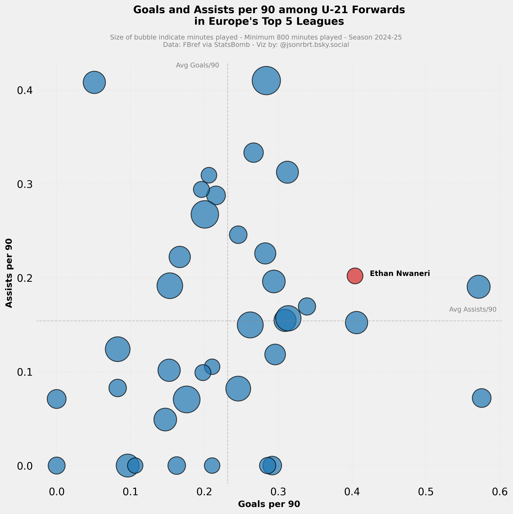

# ⚽ Arsenal Clutch Goals — Data-Driven Visualizations

This project explores and visualizes the **Top 10 Clutch Goals** scored by Arsenal during the 2024–25 season. Using custom scoring metrics, player performance data, and storytelling visuals, this repo highlights standout moments and players from the season — with a mix of tactical analysis and engaging graphics.

---

## 🔍 Project Highlights

Below are the key visual analyses included in this project:

- 🎯 **Declan Rice Touch Map vs Real Madrid**  
  Showcasing Rice's midfield dominance in a historic Champions League night.

- 🚀 **Ethan Nwaneri's U21 Comparison**  
  Where does Nwaneri rank among top U-21 attackers in Europe?  
  *Result: Elite Finisher. Elite Creator.*

- 🧱 **Gabriel Magalhães: Shot Map from Corner Kicks**  
  Breaking down his aerial threat and chance generation.

- 📊 **Arsenal’s Attacking Output With/Without Bukayo Saka**  
  A per-90-minute comparison of shots, xG, goals, and SoT with Saka on/off the pitch.

- 🏆 **Top 10 Goals Ranked by Clutch Score**  
  Custom ranking system based on opponent strength, competition, match timing, and more.

---

## 📁 Repository Structure

arsenal-clutch-goals/
│
├── notebooks/ # Jupyter notebooks for each analysis
├── visuals/ # PNG images of charts
├── html_exports/ # Interactive charts (Plotly) saved as .html
├── data/ # Cleaned data files used for analysis
├── assets/ # Logos, branding images, optional custom CSS
├── README.md # This file
├── requirements.txt # Python dependencies
├── .gitignore

---

## 📘 Notebooks Preview

| 📓 Notebook | 🔍 Description |
|------------|----------------|
| [`declan_rice_touchmap.ipynb`](notebooks/declan_rice_touchmap.ipynb) | Declan Rice's ball involvement visualized |
| [`Nwaneri_shooting_stats.ipynb`](notebooks/Nwaneri_shooting_stats.ipynb) | Scatter plot comparison with U21 forwards |
| [`gabriel_corner_shotmap.ipynb`](notebooks/gabriel_corner_shotmap.ipynb) | Shots from corner kicks visualized |
| [`bukayo_Saka_On_Off.ipynb`](notebooks/bukayo_Saka_On_Off.ipynb) | Arsenal's performance with and without Saka |
| [`Arsenal clutch goals.ipynb`](notebooks/clutch_score_table.ipynb) | Sorted table of top clutch goals |

---

## Arsenal goalscorer ranked by clutch scores

This table shows the goals scored and clutch score for each players. A goal's clutch score is determined by whether it's the first goal of the game, an equalizer, a go-ahead goal, a winning goal, or other (an additional goal in a rout or a consolation goal).

### Top 10 Clutch Goals ⚽️

1 and 2. **Declan Rice** v Real Madrid, Champions League

- **Clutch score:** 10 (First goal + go-ahead + winning goal)
- **Opponent score:** 3 - Defending champions Real Madrid
- **Competition score:** 3 - Champions League quarterfinal
- **Context score:** 3 - Arsenal’s biggest game in the Champions League in years
- **Bonus score:** 10 - He scored not once, but twice
- **Total clutch score:** 29

When Real Madrid rolled into town, Arsenal weren’t exactly giving up on their Premier League title dream - but Declan Rice deliciously taken free-kick allow Arsenal fans everywhere to dream that maybe, just maybe, they can go all the way and win the club’s first ever Champions League trophy.

Standing in Arsenal’s way, was the club that’s synonymous to the competition - Real Madrid, 14 times winner of the old big ears. The defending champion, the only club where losing the first leg 3-0 only reinforces their aura. After the first leg, ‘Remontada’ was on everyone’s lips, especially for those of Real Madrid’s persuasion. The second leg in Bernabeu will go down as the latest entry in a long line of unbelievable Champions League comeback. Liverpool in 2005, Barcelona in 2017,  and Roma in 2018.

In the end, that didn’t happened. Neither did Arsenal’s Champions League dream, cruelly put to the sword by Paris Saint-Germain’s slick, attacking machine.

Rice first goal was excellent, he ignored Jover’s instruction and proceeded to hit a curler beyond the grey wall of four Real Madrid players.

His second was hit with such ferocity and accuracy that should hang in the Louvre. Here’s a player full of beliefs, the adrenaline rushing through him. At this point, you wouldn’t bet against him scoring from his own half with a blindfold on while being rushed by hungry alligators.

For one night, Rice shows exactly why Arsenal made him the club’s first ever nine-figure signing. And it was a glorious night.

### The Contenders Category

3. **Mikel Merino** at Leicester City, Premier League	

- **Clutch score:** 9 (First goal + go-ahead + late goal + winning goal)
- **Opponent score:** 1
- **Competition score:** 3
- **Context score:** 3 - No fit senior striker, away from home
- **Bonus score:** 1 - He scored not once, but twice
- **Total clutch score:** 17

According to Wikipedia, the principle 'Less is more' has the basic meaning of keeping things simple. That was certainly the case when Arsenal visited the King Power Stadium to play Leicester City. At that stage of the season, Arsenal were without Saka and Gabriel Jesus, who sustained a knee injury against Manchester United in the FA Cup. To make matters worse, Kai Havertz suffered a hamstring injury during training camp in Dubai.

With Arsenal title hope hanging by a thread, a draw against a relegation threatened Leicester would be a significant blow for The Gunners. Coming off the bench in the 68th minute, Merino went on to score a brace. He spoke of how he prepared playing as a striker:

_"I think they did it deliberately, not telling me until the last minute because they know I like to have everything under control, have lots of information, and by not telling me earlier they removed the ‘stress’"_

Sometimes, less (instruction) is more.

4. **Myles Lewis-Skelly** v Manchester City, Premier League	

- **Clutch score:** 1 (Other)
- **Opponent score:** 3
- **Competition score:** 3
- **Context score:** 3 - Arsenal put the nail in the coffin of City’s title bid
- **Bonus score:** 5 - 18 year-old academy graduate scored first Arsenal goal and then copied the opponent’s celebration? Chef’s kiss.
- **Total clutch score:** 15

During the first game earlier in the season against Manchester City at the Etihad, Lewis-Skelly's name is destined to be one of those trivia answer, after picking up a yellow card before even making his debut for Arsenal (which he did later in added time).

Fast forward to February and Lewis-Skelly had cemented his place in the starting XI playing in the left back role. Initially unable to play in the game after he was sent-off by Michael Oliver in the Wolves game, an error so egregious that it unites almost everyone regardless of their club affiliation, Lewis-Skelly went on to made his mark in the game by scoring Arsenal's third goal of the game.

Asking for the ball from Declan Rice, Lewis-Skelly then drive onto City's penalty area setting himself for a right-footed finish that was too hot to handle for Stefan Ortega in City's goal.

He then went on to celebrate:

Safe to say Haaland won't be asking 'Who the f* are you?'. It's Myles Lewis-Skelly, remember the name. 

5. **Riccardo Calafiori** at Wolves, Premier League	

- **Clutch score:** 7 (First goal + go-ahead + winning goal)
- **Opponent score:** 1.5
- **Competition score:** 3
- **Context score:** 3 - In a season where Arsenal seems to be on the receiving end of questionable calls, this one takes the cake.
- **Total clutch score:** 14.5

Arsenal had been on the receiving end of some baffling refereeing decisions, but Michael Oliver’s decision to send off Myles Lewis-Skelly for a challenge that is admittedly cynical, but nowhere near meeting the threshold of what you would consider reckless and violent - surely topped the list. It means Arsenal had to play with 10-men for the majority of the game (just like against Brighton and Manchester City), stretching a depleted squad just before a crucial meeting against Manchester City a week later.

Calafiori scored the only goal of the game - which led me to believe that he could do a job as a striker in a pinch (see his goal against Manchester City and PSV in the Champions League). Thankfully it did not come to that (yet!) but in a long season, where you feel the officials were against you, away from home - Calafiori’s goal here is worthy of a clutch tag.

### Early Season Markers

6. **Bukayo Saka** v Liverpool, Premier League	

- **Clutch score:** 4 (First goal + go-ahead)
- **Opponent score:** 3
- **Competition score:** 3
- **Context score:** 3 - First place taking on second place
**Bonus score:** 1 - Saka’s 50th Premier League goal, the youngest Arsenal player to do it
- **Total clutch score:** 14

It was a special day for Arsenal’s star, Bukayo Saka, as he scored his 50th Premier League goal, making him the youngest Arsenal player to achieve the feat at 23 years and 52 days. He also wore the captain’s armband as Martin Ødegaard was sidelined because of an injury picked up while on international duty with Norway.

A long ball from Ben White caught Andrew Robertson napping, Saka took a touch to control, cuts inside with his second touch leaving Robertson on the floor before unleashing an unstoppable shot past Caoimhín Kelleher in goal.

Saka was in fine form in the first quarter of the season with 10 goals + assists in all competitions going to this match. It’s a shame he suffered a hamstring injury in late December as Arsenal fans wonder what might have been had Saka managed to stay fit.

7. **Riccardo Calafiori** at Manchester City, Premier League	

- **Clutch score:** 3 (Equalizer)
- **Opponent score:** 3
- **Competition score:** 3
- **Context score:** 3 - Champions against runners-up for the past two seasons
- **Bonus:** 2 - debut goal in first start for Arsenal
- **Total clutch score:** 14

Calafiori endured a stop-start debut season at Arsenal owing to niggling injuries - he featured in 29 matches across three competitions, accruing 1.496 minutes. Calafiori did made the best first impression, scoring a well-taken equalizer against Manchester City in an early top of the table clash back in September. Twenty-two minutes into his first start, Arsenal were down by a goal after Erling Haaland opened the scoring in the ninth minute.

A quick restart by Arsenal saw Martinelli lay off the ball for Calafiori, with the Italian not hesitating with a leg-footed curler that nestled in the far corner, beyond Ederson’s reach. Even though Arsenal could not hang on to the lead and ultimately had to settle for a 2-2 draw after playing with 10-men for the majority of the game, Calafiori could not asked for a better start to his Arsenal career.

### Set-Piece FC Category

8. **Gabriel Magalhaes** at Spurs, Premier League	

- **Clutch score:** 7 (First goal + go-ahead + winning goal)
- **Opponent score:** 3
- **Competition score:** 2.5
- **Context score:** 1.5 - The North London Derby is always a big game but considering the season that Spurs had in the league, it was a match against a bottom half side.
- **Total clutch score:** 14

Arsenal are no strangers to scoring centre backs, Tony Adams with that goal against Everton in the league to seal the double back in 1998. Thomas Vermaelen for that one season. Laurent Koscielny’s equalizer against Hull City in the FA Cup final in 2014.

Gabriel though seems to be a class above those men when it comes to scoring goals. This season, the Arsenal’s number 6 scored five goals (should be six but his goal against, you guessed it, Tottenham at the Emirates was judged to be an own goal, boo!) four of them coming from set-pieces. Ange Postecoglou’s was heavily criticized for his comment on defending set-piece, and while Tottenham’s ineptitude knows no bounds - credit to Nicolas Jover, Arsenal’s set-piece coach and the team for constantly creating opportunities to score via set-piece.

All the sweeter as Gabriel’s header on this day embodies the ‘One-nil to the Arsenal’ chant.

### Best of the rest category

9. **Leandro Trossard** at Aston Villa, Premier League	

-  **Clutch score:** 7 (First goal + go-ahead + winning goal)
- **Opponent score:** 2
-  **Competition score:** 2.5
-  **Context score:** 2 - A tough away game early in the season against a team that did the double over Arsenal in the league the season prior. Oh and an angry Belgian winger.
- **Total clutch score:** 13.5

Aston Villa did the double against Arsenal back in 2023-24 and it was the 2-0 win back in April that practically ended Arsenal’s title bid. With former Arsenal men Unai Emery on the sidelines and Emi Martinez in goal, it’s definitely a game where Arteta would want his side to impose themselves while maintaining a perfect start to the season.

Trossard had been dropped in favor of Gabriel Martinelli to start the season. His nature of exit from Brighton and rumors of interest from Saudi Arabia contributes to the feeling that perhaps Arsenal fans have seen the last of him. The Belgian winger came off the bench and two minutes later, opened the scoring for Arsenal in a 2-0 win.

And he enjoyed every moment of it. Look at this [glorious celebration](https://www.reddit.com/r/soccer/comments/1f0cgbb/saliba_pushes_trossard_to_do_his_celebration/?utm_source=share&utm_medium=mweb3x&utm_name=post_embed&utm_term=1&utm_content=1) from Trossard. The Belgian finished the season with 10 goals and 9 assists, with talks ongoing regarding improved terms.

10. **Ethan Nwaneri** at Brighton, Premier League	

- **Clutch score:** 6 (First goal + go-ahead)
- **Opponent score:** 2
- **Competition score:** 2.5
- **Context score:** 1.5 - With Arsenal missing Bukayo Saka to a significant injury, the teenager showed why Arteta gave him an Arsenal debut at 15
- **Total clutch score:** 12

This goal was not Nwaneri’s first Premier League goal (that came against Nottingham Forest in November) - but it is one that shows why Arteta trusted him to step into the Saka-sized hole in Arsenal’s frontline. Picking the ball up in midfield from Merino’s lofted ball, Nwaneri drove through acres of space directly to Brighton’s penalty area. From there he unleashed a curler with his left foot that beat Bart Verbreuggen in the home’s team goal. Making him the third player to score five or more goals in all competitions after Michael Owen and Wayne Rooney.

## 📜 Data Sources & Attribution

- Match and player data: WhoScored.com

- U-21 performance data: OPTA via FBRef

- Logos, player portraits and pitch visuals: sofifa.com, MPLSoccer

- Photo of Myles-Lewis Skelly: standard.co.uk

Graphics by @jsonrbrt.bsky.social

## 📄 License

This project is licensed under the MIT License.